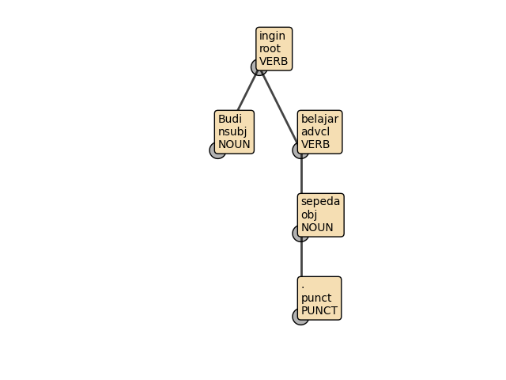
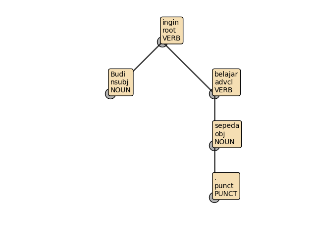
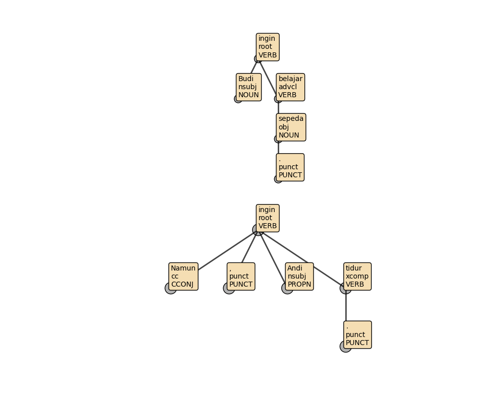

.. _draw_dep_tree:

********************
Draw Dependency Tree
********************

.. currentmodule:: aksara

Suppose after doing dependency parsing on a text, you want to visualize
the dependency realation among each tokens in the text, then you can use 
:class:`TreeDrawer` to draw and/or save dependency tree. 

How :class:`TreeDrawer` draw the tree? :class:`TreeDrawer` will use deprel and head id column
in CoNNL-U to determine the parent of a node/token. A node with deprel = 'root' will be placed
at the top of the tree. For other nodes, its parent is determined by its head id.

Note that before drawing the tree, most of the time you may need to do 
dependency parsing on the text first.

.. change working directory to source/savefig/

.. ipython:: python
    :suppress:
    
    import os
    os.chdir(os.path.join('source', 'savefig'))

    def save_if_missing(drawer, conllu_data, file_path, **kwargs):
        if not os.path.lexists(file_path):
            drawer.save_image(conllu_data, file_path, **kwargs)

Drawing Tree
~~~~~~~~~~~~

First, you need to prepare the data that will be visualized.

.. ipython:: python
    :okwarning:

    from aksara import DependencyParser
    parser = DependencyParser()
    conllu_data = parser.parse('Budi ingin belajar sepeda.')

Now, we will try to visualize `conllu_data`.

.. ipython:: python
    :okwarning:

    from aksara import TreeDrawer
    drawer = TreeDrawer()
    
    drawer.draw(conllu_data)
    
.. ipython:: python
    :okwarning:
    :suppress:

    save_if_missing(drawer, conllu_data, 'autotree1.png')

| 
NOTE: for multi sentences text, it is recommended to use a custom matplotlib.Axes to control the size
of each subplots (one sentence = one subplot).

Saving Tree
~~~~~~~~~~~

To save a tree to a file you can use :func:`save_image` method in :class:`TreeDrawer`. The following example shows
how to save the dependency tree in 'tree.png'.

Similar to :func:`TreeDrawer.draw`, :func:`save_image` can only process a list of list of :class:`ConlluData`. 
Besides a list of list of :class:`ConlluData`, :func:`save_image` also need the file path to save the image.

The following example shows how to save dependency tree of ``conllu_data`` in 'out_tree1.png'.

.. ipython:: python
    :okwarning:

    from aksara import TreeDrawer
    drawer = TreeDrawer()

    drawer.save_image(conllu_data, 'out_tree1.png')

.. ipython:: python
    :okwarning:

    os.remove('out_tree1.png')

Scaling Horizontal and Vertical Distance
~~~~~~~~~~~~~~~~~~~~~~~~~~~~~~~~~~~~~~~~

If after using :func:`draw` or :func:`save_image` method you feel that the horizontal distance and/or vetical distance between 
node is too big/small, then you can tune their distance using ``scale_x`` and ``scale_y`` keyword variable. If not set ``scale_x``
and ``scale_y`` have default value of 1.0 .

First, lets draw the tree with default scaling.

.. ipython:: python
    :okwarning:

    drawer.draw(conllu_data)

|
| Lets increase its scale for horizontal distance to 2.0 .

.. ipython:: python
    :okwarning:
    
    from aksara import TreeDrawer
    drawer = TreeDrawer()

    drawer.draw(conllu_data, scale_x=2.0)

.. ipython:: python
    :okwarning:
    :suppress:

    save_if_missing(drawer, conllu_data, 'autotree2.png', scale_x=2.0)

Note: ``scale_x`` and ``scale_y`` can also be used with :func:`TreeDrawer.save_image`.

Multi Sentences: Control Tree Size with Custom Axes
~~~~~~~~~~~~~~~~~~~~~~~~~~~~~~~~~~~~~~~~~~~~~~~~~~~

For ``matplotlib`` drawer (default for :class:`TreeDrawer`), the axes may also be supplied from ``axs`` keyword 
argument. This is really useful for if the list of list on :class:`ConlluData` has more than one element or the text contains
more than one sentence.

``axs`` keyword argument can accept list of axes, axes, and plt.subplots return value.

The following example show how to use custom axes to visualize dependency tree of two sentences text.

First, lets do dependency parsing on the text.

.. ipython:: python
    :okwarning:

    text = 'Budi ingin belajar sepeda. Namun, Andi ingin tidur.'
    two_conllus = parser.parse(text)

| 
Next, lets create the axis. If using plt.subplots, make sure that the number of rows is equal to the number of sentences, and the 
number of columns = 1.

.. ipython:: python
    :okwarning:

    import matplotlib.pyplot as plt

    fig, axes = plt.subplots(nrows=len(two_conllus), ncols=1, figsize=(10, 8))

Then lets draw the tree.

.. ipython:: python
    :okwarning:

    drawer = TreeDrawer()

    drawer.draw(two_conllus, axs=axes)

.. ipython:: python
    :okwarning:
    :suppress:

    save_if_missing(drawer, two_conllus, 'autotree3.png', axs=axes)

Using Plotly Drawer
~~~~~~~~~~~~~~~~~~~

While TreeDrawer defaultly use matplotlib as the drawer. Aksara also provides alternative drawer, Plotly. 
To use Plotly Drawer, you can add 'plotly' when initialize TreeDrawer or 
use :func:`TreeDrawer.set_drawer(drawer_name)` method.

In the following example, we will try to visualize dependency tree of "Budi ingin belajar sepeda." using Plotly drawer.

Note that to save the tree image from plotly drawer, besides using :func:`TreeDrawer.save_image`, 
you may also use the download button (camera icon on the top right of the plot).

.. plotly::

    # We need to represtent the text in CoNNL-U format
    from aksara import DependencyParser

    parser = DependencyParser()
    conllu_data = parser.parse('Budi ingin belajar sepeda.')

    # draw conllu_data
    from aksara import TreeDrawer

    drawer = TreeDrawer('plotly')
    drawer.draw(conllu_data)

.. ipython:: python
    :suppress:
    
    import os
    os.chdir(os.path.join('..', '..'))